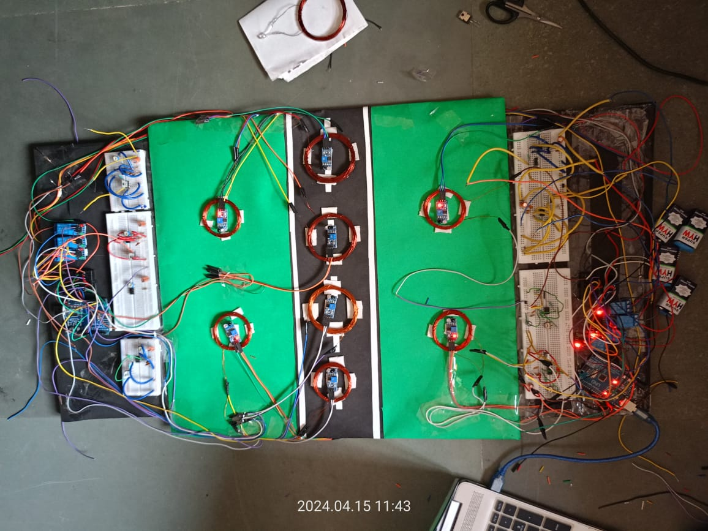
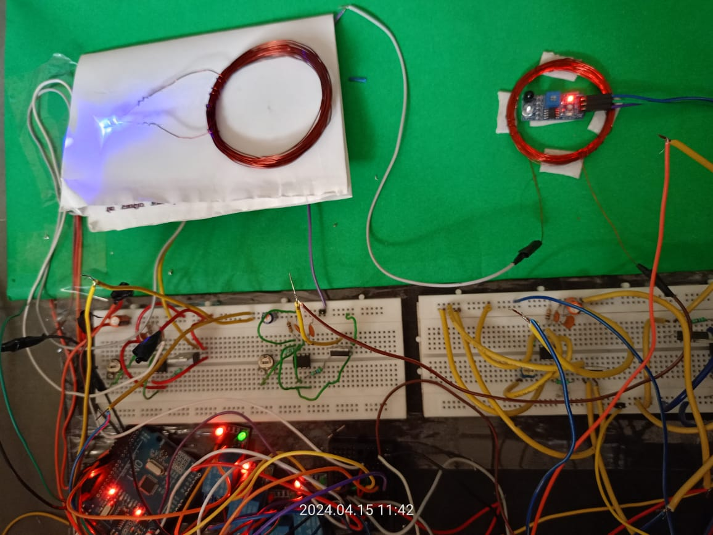
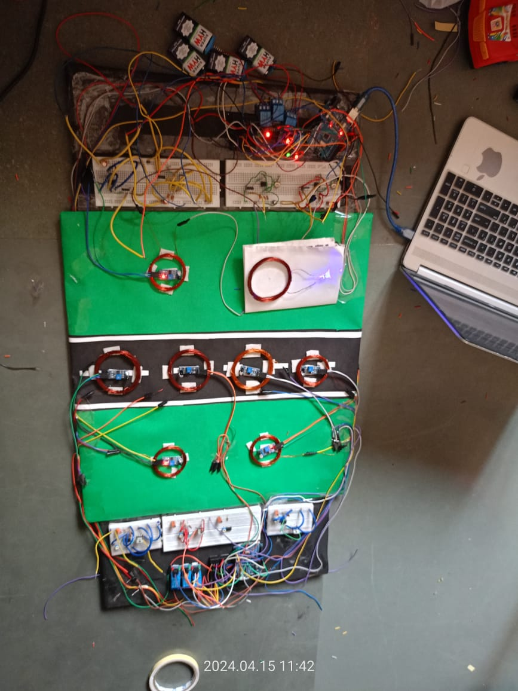
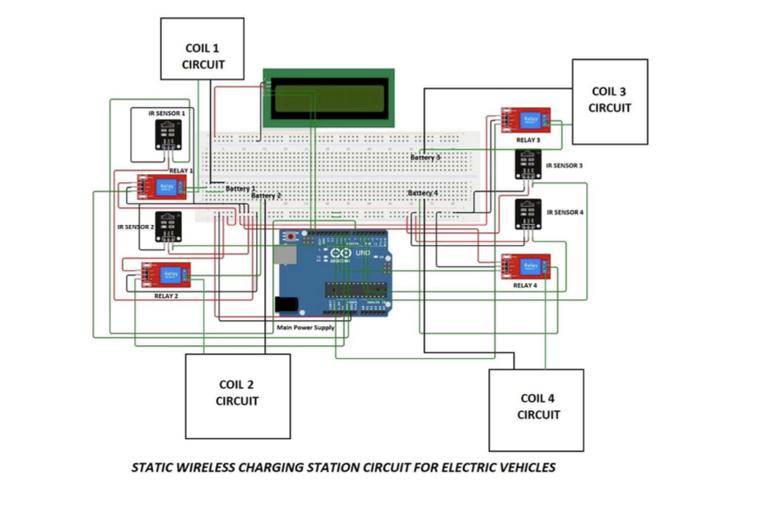
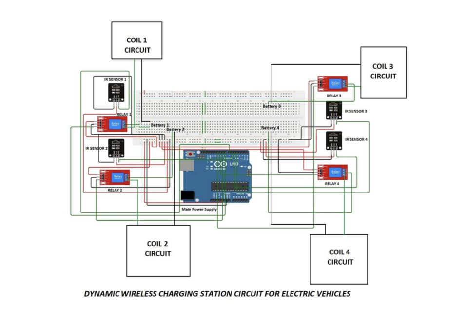

# 🚗 Wireless Electric Vehicle Charging System (U-Drain V-Charge)


---

## 🚀 Project Summary (Recruiter-Friendly)

This repository contains a **hardware–software integrated prototype** of a  
**Wireless Electric Vehicle (EV) Charging System** using **inductive power transfer**.

The project demonstrates how **embedded systems, power electronics, and sensing** can be combined to enable **contactless EV charging**, supporting both:

- **Static Charging** → Vehicle parked  
- **Dynamic Charging** → Vehicle charging while moving  

The work addresses **real-world EV infrastructure challenges** such as safety, automation, and scalability, making it highly relevant to **EV technology, embedded systems, and sustainable energy roles**.

---

## 🎯 Key Highlights (Why This Matters)

- Solves a **real EV infrastructure problem**
- Demonstrates **end-to-end system design**
- Combines **hardware + embedded software**
- Includes **automation, sensing, control, and billing**
- Relevant to:
  - Embedded Systems
  - EV Technology
  - Power Electronics
  - Smart Infrastructure
  - IoT-ready systems

---

## 🖼️ Prototype Overview



---

## ⚡ Static Wireless Charging

In static charging, the vehicle is parked above the transmitter coil.

- IR sensors detect vehicle presence  
- Arduino activates the relay  
- Charging duration is measured  
- Billing is calculated and displayed on LCD  



---

## 🚘 Dynamic Wireless Charging

In dynamic charging, multiple transmitter coils are activated sequentially as the vehicle moves.

- Enables **charging while in motion**
- Reduces **range anxiety**
- Demonstrates concept of **electric roads**



---

## 🔌 Circuit Diagrams

### Static Charging Circuit


### Dynamic Charging Circuit


---

## ⚙️ Working Principle

The system works on **electromagnetic induction**, similar to a transformer:

- A **transmitter coil** produces a time-varying magnetic field
- A **receiver coil** induces voltage from the field
- Power is rectified and used to charge the battery

Performance depends on:
- Coil alignment  
- Air gap distance  
- Operating frequency  

This principle was first proposed by **Nikola Tesla (1896)**.

---

## 🔧 Tech Stack & Components

### Hardware
- Arduino UNO  
- IR Sensors  
- IRF540N MOSFET  
- 555 Timer IC  
- Relay Modules  
- Transmitter & Receiver Coils  
- LCD Display  
- Breadboards & Power Supply  

### Software
- Embedded C / Arduino IDE  
- LCD (I2C) Library  

---

## 🧠 System Features

✔ Static & dynamic charging modes  
✔ Automatic vehicle detection  
✔ Relay-based power switching  
✔ Charging time calculation  
✔ Usage-based billing logic  
✔ Real-time LCD feedback  

---

## 📁 Repository Structure

```text
Wireless-EV-Charging-System/
│
├── README.md
│
├── docs/
│   ├── Proposal.pdf
│   └── Final_Presentation.pptx
│
├── images/
│   ├── prototype/
│   │   ├── prototype_overview.jpg
│   │   ├── static_charging.jpg
│   │   └── dynamic_charging.jpg
│   │
│   └── circuit_diagrams/
│       ├── static_charging_circuit.png
│       └── dynamic_charging_circuit.png
│
├── code/
│   ├── static_charging/
│   │   └── static_charging.ino
│   │
│   └── dynamic_charging/
│       └── dynamic_charging.ino
│
├── video/
│   └── demo_video.mp4
│
└── LICENSE
```

## 💻 Arduino Implementation

### Static Charging
- Vehicle detection using IR sensors  
- Relay-based power control  
- Charging duration measurement  
- Billing calculation  
- LCD output  

📁 `code/static_charging/static_charging.ino`

### Dynamic Charging
- Sequential coil activation  
- Real-time IR sensor control  

📁 `code/dynamic_charging/dynamic_charging.ino`

---

## 🎥 Demonstration Video

📁 `video/demo_video.mp4`

The video demonstrates:
- Complete hardware setup  
- Static charging operation  
- Dynamic charging simulation  
- LCD output and billing  

---

## 🚀 Applications

### Static Charging
- Residential EV charging  
- Parking lots and malls  
- Offices and commercial buildings  
- Fleet charging stations  

### Dynamic Charging
- Electric roads and highways  
- Public transportation  
- Autonomous vehicles  
- Logistics and freight systems  

---

## ⚠️ Limitations

- Lower efficiency compared to wired charging  
- Coil alignment sensitivity  
- High infrastructure cost  
- Heat generation  
- No universal wireless EV charging standard  

---

## 🔮 Future Scope

- Integration with solar and wind energy  
- Higher-power fast wireless charging  
- Improved alignment techniques  
- Smart grid & IoT-based charging management  

---

## 📜 License

This project is licensed under the **MIT License**.  
Free to use, modify, and distribute with attribution.
